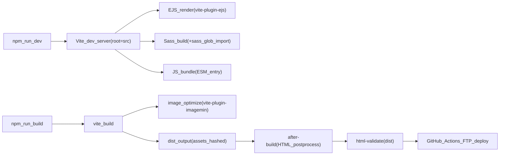

# アーキテクチャ仕様（t2025-10-01vite）

本ドキュメントは、静的サイトテンプレート `t2025-10-01vite` の設計・構成・各機能の仕様を定義する。

---

## 1. 設計概要

本テンプレートは **Vite + EJS + Sass** を基盤とした静的サイトジェネレータである。  
ビルド時に **画像最適化（圧縮/WebP生成）** と **HTML後処理（`<picture>`化・`width/height`自動付与）** を自動実行し、品質担保として **husky + html-validate** によるバリデーション、運用として **GitHub Actions** による自動デプロイを備える。

### 主要ディレクトリの役割

| パス | 役割 |
|------|------|
| `src/` | 開発ソース（Viteの `root`） |
| `dist/` | ビルド成果物（最終配布物） |
| `config/` | プロジェクト設定 |
| `scripts/` | ビルド後処理スクリプト |
| `.github/workflows/` | CI/CD 定義 |
| `.husky/` | Git フック |

---

## 2. システム構成図



- ビルドは `vite build` → `scripts/after-build.mjs`（HTML後処理）の順で実行される（`package.json` の `build` スクリプトで定義）
- HTML検証は `dist/` を対象に `html-validate` で実行する（`validate:html`）

---

## 3. 機能仕様

### 3.1 EJS テンプレートエンジン

#### 関連ファイル
- `vite.config.js` — `ViteEjsPlugin({ ...siteConfig, posts })` でEJSへ変数を注入
- `vite.config.js` — `liveReload(["ejs/**/*.ejs"])` でEJS更新時にリロード
- `vite.config.js` — `globSync("src/**/*.html", { ignore: ["src/public/**/*.html"] })` を `rollupOptions.input` に登録し、複数HTMLを自動ビルド対象とする
- `src/**/*.html` — HTML側でEJSの `include()` により共通パーツを組み立てる
- `src/ejs/common/*.ejs` — 共通パーツ（head / header / footer）
- `src/ejs/components/*.ejs` — ページ固有の部品

#### 動作仕様
- 各ページHTMLは `pages['top']` のように `config/site.config.js` のページ設定を取得し、`page` オブジェクト（title / description / path / root 等）を構成する
- `ejsPath`（`config/site.config.js` で定義）を使い、`common/_head.ejs` 等を `include` する

#### ページHTML側の構成例
- `src/index.html`
  - `include(ejsPath + 'common/_head.ejs', { page })`
  - `include(ejsPath + 'common/_header.ejs', { page })`
  - `include(ejsPath + 'common/_footer.ejs', { page })`

### 3.2 SCSS ビルドパイプライン

#### 関連ファイル
- `src/ejs/common/_head.ejs` — `<link rel="stylesheet" href="/assets/sass/style.scss">` でSCSSを読み込む（Viteがビルド対象として解釈）
- `src/assets/sass/style.scss` — エントリファイル。`@use "./layouts/**";` のようなglob指定で構成を集約
- `vite.config.js` — `vite-plugin-sass-glob-import` により `@use "./**"` のglobを有効化
- `postcss.config.cjs` — `autoprefixer` / `postcss-sort-media-queries`（`mobile-first`）

#### ビルド出力
- `assets/css/[name]-[hash].css`（`vite.config.js` の `assetFileNames` で定義）

### 3.3 JS バンドル

#### 関連ファイル
- `src/ejs/common/_head.ejs` — `<script type="module" src="/assets/js/main.js"></script>`
- `src/assets/js/main.js` — エントリファイル。機能別モジュール（`_drawer.js`, `_splide-*.js`, `_fadein.js` 等）を `import` で束ねる
- `vite.config.js` — `entryFileNames` / `chunkFileNames` を `assets/js/[name]-[hash].js` に統一

### 3.4 画像最適化パイプライン

#### 関連ファイル
- `vite.config.js` — `@vheemstra/vite-plugin-imagemin` を使用

#### 圧縮仕様
- 対象: `include: /\.(png|jpe?g|gif|svg)$/i`
- JPEG: `imagemin-mozjpeg({ quality: 75, progressive: true })`
- PNG: `imagemin-pngquant({ quality: [0.65, 0.8], speed: 3 })`
- GIF: `imagemin-gifsicle({ optimizationLevel: 2 })`
- SVG: `imagemin-svgo()`

#### WebP 生成仕様
- `makeWebp` により jpg / png / gif から WebP を生成
- `skipIfLargerThan: "optimized"` — 元画像より大きくなる場合は生成しない

#### ビルド出力
- `assets/images/[name]-[hash][extname]`（`vite.config.js` の `assetFileNames` で定義）

#### AVIF について
- AVIF の「生成」は現状未対応。ただし `scripts/after-build.mjs` は `dist/` にAVIFが存在する場合 `<source type="image/avif">` を挿入する（"存在すれば対応する"構成）

### 3.5 HTML後処理（after-build）

#### 関連ファイル
- `scripts/after-build.mjs`

#### 対象
- `dist/**/*.html` を再帰走査

#### 処理仕様
1. `` を対象に、元画像の実寸を `sharp(...).metadata()` で取得し `width` / `height` を付与
2. `dist/` にWebP / AVIFが存在する場合:
   - `` を `<picture>` でラップし、`<source type="image/webp">` / `<source type="image/avif">` を自動挿入
   - 既に `<picture>` の場合は破壊せず、不足する `<source>` のみ補完（art-direction用の `media` も維持）
   - 各 `<source>` にも参照ファイルの実寸を付与
3. `js-beautify` でHTML全体を整形

#### スキップ条件
- `http(s)://` の外部URL
- `data:` スキーム
- SVG（非ラスタ画像は `<picture>` 化しない）

### 3.6 バリデーション

#### 関連ファイル
- `package.json` — `validate:html`: `html-validate dist/`、`validate:build`: `npm run build && npm run validate:html`
- `.htmlvalidate.json` — `extends: ["html-validate:recommended"]` + 独自ルール調整
- `.husky/pre-commit` — `npm run build:only`（コミット前にビルドを実行）
- `.husky/pre-push` — `npm run validate:build`（プッシュ前にビルド + HTML検証）

#### Git hooks の動作
- **pre-commit**: `npm run build:only`（ビルドのみ実行し、通らなければコミット拒否）
- **pre-push**: `npm run validate:build`（ビルド + HTML検証、通らなければプッシュ拒否）

### 3.7 ページ情報管理（site.config.js）

#### 関連ファイル
- `config/site.config.js` — ページ情報・共通設定の一元管理
- `config/utils.js` — `isExcluded(key, excludePages)` 関数（パターンマッチングによる除外判定）
- `vite.config.js` — `ViteEjsPlugin({ ...siteConfig, posts })` でEJSへ注入

#### 設定構造
- `pages` オブジェクト: 各ページの `label` / `root` / `path` / `title` / `description` 等を集約
- `headerExcludePages` / `drawerExcludePages`: メニューから除外するページのキー配列
- `ejsPath` / `domain` / `titleSeparator`: 共通設定

#### テンプレート側での利用
- `src/ejs/common/_header.ejs` で `Object.entries(pages)` をループし、ヘッダ/ドロワーメニューを生成
- `isExcluded(key, headerExcludePages)` 等で除外制御（`demo*` や `demo[A-Z]*` のパターンに対応）

### 3.8 CI/CD（GitHub Actions）

#### 関連ファイル
- `.github/workflows/deploy.yml`

#### トリガー
- `push`（`main` / `master`）
- `pull_request`（`main` / `master`）
- `workflow_dispatch`（手動実行）: `deploy_to_production` 入力あり

#### 処理フロー
1. `actions/checkout@v4`
2. `actions/setup-node@v4`（Node 20、npmキャッシュ）
3. `npm ci`
4. `npm run build`
5. FTPデプロイ（`SamKirkland/FTP-Deploy-Action@v4.3.4`）
   - push → テスト環境
   - PR → PRテスト環境
   - 手動（`deploy_to_production: true`）→ 本番
6. Discord通知（`Ilshidur/action-discord@master`）: 成功/失敗で分岐

#### 必要な GitHub Secrets
- `FTP_SERVER`
- `FTP_USERNAME`
- `FTP_PASSWORD`
- `TEST_URL`
- `DISCORD_WEBHOOK`

### 3.9 デモページシステム

#### 関連ファイル
- `src/demo/**/index.html` — 各デモページ（例: `src/demo/demo-accordion/index.html`）
- `src/ejs/components/_p-demo.ejs` — デモ一覧の自動生成

#### 動作仕様
- 各デモページHTMLで `const key = 'demoAccordion'` のように `pages` のキーを指定してページ情報を参照
- `_p-demo.ejs` は `pages` から `demo` で始まるキーを抽出し、デモ一覧を自動生成する

### 3.10 メールアドレス保護機能

#### 関連ファイル
- `config/utils.js` — `email()` 関数の定義（`toString()` メソッドにより文字列化時に自動的にHTMLを返す）
- `config/site.config.js` — `email` 関数を `siteConfig` に追加し、EJSテンプレートで利用可能にする
- `src/ejs/components-demo/_c-email.ejs` — メールアドレス保護用のHTML出力
- `src/assets/js/_email-protection.js` — メールアドレスの復元とリンク生成
- `src/assets/js/main.js` — `_email-protection.js` をインポート

#### 使用方法

1. データ定義時に `email()` 関数を使用:
```javascript
const documentItems = [
  {
    heading: 'メールアドレス',
    text: email('afmaar128', 'gmail.com')
  },
  {
    heading: '事業内容',
    text: 'Web制作・システム開発・コンサルティング'
  },
];
```

2. 表示部分は `<%- item.text %>` だけで完結する（条件分岐不要）:
```ejs
<dl class="p-demo-dl">
  <% documentItems.forEach((item) => { %>
    <dt class="p-dl__dt"><%- item.heading %></dt>
    <dd class="p-dl__dd"><%- item.text %></dd>
  <% }); %>
</dl>
```

3. リンクなしで表示する場合:
```javascript
text: email('afmaar128', 'gmail.com', { link: false })
```

#### 処理フロー

1. **ビルド時（サーバー側）**
   - `email('afmaar128', 'gmail.com')` でメールアドレスオブジェクトを生成
   - `toString()` メソッドにより、文字列として扱われた時点で自動的にHTMLを返す
   - 出力HTML: `<span class="js-email-protection" data-email-user="afmaar128" data-email-domain="gmail.com" data-link="true"></span><noscript>afmaar128[at]gmail.com</noscript>`

2. **ブラウザ（クライアント側）**
   - `_email-protection.js` が `DOMContentLoaded` で実行
   - `.js-email-protection` 要素を検索してメールアドレスを復元
   - `data-link` が `true` → `<a>` タグを生成、`false` → テキストのみ表示

#### スパムボット対策の仕組み
- HTMLに `@` を含めない（`data-email-user` と `data-email-domain` に分割）
- JavaScriptで動的にメールアドレスを復元
- `<noscript>` タグでJavaScript無効時にも情報を表示

---

## 4. ディレクトリ構成

```
src/                     開発ルート（Vite root）
  index.html             エントリ（複数HTML対応）
  contact/index.html
  demo/**/index.html
  privacy/index.html
  ejs/                   EJS テンプレート
    common/              共通パーツ（_head.ejs, _header.ejs, _footer.ejs）
    components/          ページ部品
    data/                ダミーデータ等
  assets/
    sass/                Sass（グロブインポート対応）
    js/                  JSモジュール
    images/              画像（dummy / common）
  public/                Vite public（root=src のため src/public）
dist/                    本番出力（ビルド生成物）
config/
  site.config.js         ページ情報・共通設定
  utils.js               ユーティリティ（除外判定、email関数）
scripts/
  after-build.mjs        HTML後処理スクリプト
.github/workflows/
  deploy.yml             CI/CD 定義
.husky/
  pre-commit             コミット前ビルド
  pre-push               プッシュ前ビルド+検証
```

---

## 5. npm scripts 仕様

### 開発
- `dev` — `vite`（開発サーバー起動）

### ビルド
- `build` — `vite build && node scripts/after-build.mjs`（本番ビルド + HTML後処理）
- `build:only` — `vite build`（後処理なし）

### プレビュー
- `preview` — `vite preview`
- `build:preview` — `npm run build && npm run preview`

### クリーン
- `clean` — `dist` / `src/.vite` / `src/.img` を削除
- `clean:all` — `clean` + `node_modules` + `package-lock.json` も削除
- `reinstall` — `clean:all` → `npm install`

### 検証
- `validate:html` — `html-validate dist/`
- `validate:build` — `build` → `validate:html`

### Git hooks
- `prepare` — `husky`

---

## 6. 拡張・変更ガイド

- **ページ追加**: `src/` 配下に `xxx/index.html` を追加し、`config/site.config.js` の `pages` に同キーを追加
- **メニュー除外制御**: `headerExcludePages` / `drawerExcludePages` を調整（`config/utils.js` のパターン仕様に従う）
- **画像最適化の品質調整**: `vite.config.js` の `imagemin*` / `makeWebp` 設定を変更
- **`<picture>` 化の挙動調整**: `scripts/after-build.mjs` の対象条件・挿入順・整形方針を変更
- **デプロイ先・方式変更**: `.github/workflows/deploy.yml` を編集（FTP → 別方式への置換など）

---

## 7. 関連ファイル一覧

- Vite設定: `vite.config.js`
- ページ設定: `config/site.config.js`
- 除外判定: `config/utils.js`
- HTML後処理: `scripts/after-build.mjs`
- HTML検証: `.htmlvalidate.json`
- Git hooks: `.husky/pre-commit`, `.husky/pre-push`
- デプロイ: `.github/workflows/deploy.yml`
