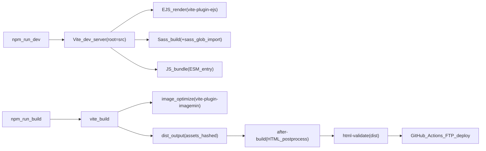

# アーキテクチャ仕様（t2025-10-01vite）

人間向けの読み方: **ルート `README.md` → 本書**。文書化の基準（いつ ADR にするか等）はナレッジ [`wiki/template-repository-docs.md`](/Users/yoshiaki/working/2026-04-23kn/wiki/template-repository-docs.md)。

本ドキュメントは、**静的サイト制作用テンプレート**（略称 **静的テンプレ**。リポジトリ名 `t2025-10-01vite`）の設計・構成・各機能の仕様を定義する。呼称の正本はナレッジベースの `wiki/operated-repositories.md`（表記ルール）。

## 本ドキュメントの責務

- このドキュメントは、**テンプレート固有の技術仕様の正本**です。
- 導入手順・日常運用の入口は `README.md` を参照してください。
- 汎用コーディングルールや分野横断ナレッジは、ナレッジベースの `/Users/yoshiaki/working/2026-04-23kn/wiki/coding-conventions.md` および子ページを参照し、本書では重複記載しません。旧 `2026-03-20kn` リポジトリは廃止とする。

---

## 1. 設計概要

静的テンプレは **Vite + EJS + Sass** を基盤とした静的サイトジェネレータである。  
ビルド時に **画像最適化（圧縮/WebP生成）** と **HTML後処理（`<picture>`化・`width/height`自動付与）** を自動実行し、品質担保として **husky + html-validate** によるバリデーション、運用として **GitHub Actions** による自動デプロイを備える。

### 主要ディレクトリの役割

| パス | 役割 |
|------|------|
| `src/` | 開発ソース（Viteの `root`） |
| `dist/` | ビルド成果物（最終配布物） |
| `config/` | プロジェクト設定 |
| `scripts/` | ビルド後処理スクリプト |
| `.github/workflows/` | CI/CD 定義 |
| `.husky/` | Git フック |

---

## 2. システム構成図


```mermaid
flowchart LR
  dev["npm_run_dev"] --> viteDev["Vite_dev_server(root=src)"]
  viteDev --> ejsRender["EJS_render(vite-plugin-ejs)"]
  viteDev --> sassBuild["Sass_build(+sass_glob_import)"]
  viteDev --> jsBundle["JS_bundle(ESM_entry)"]

  build["npm_run_build"] --> viteBuild["vite_build"]
  viteBuild --> imgMin["image_optimize(vite-plugin-imagemin)"]
  viteBuild --> distOut["dist_output(assets_hashed)"]
  distOut --> afterBuild["after-build(HTML_postprocess)"]
  afterBuild --> validate["html-validate(dist)"]
  validate --> deploy["GitHub_Actions_FTP_deploy"]
```

- ビルドは `vite build` → `scripts/after-build.mjs`（HTML後処理）の順で実行される（`package.json` の `build` スクリプトで定義）
- HTML検証は `dist/` を対象に `html-validate` で実行する（`validate:html`）

---

## 3. 機能仕様

### 3.1 EJS テンプレートエンジン

#### 関連ファイル
- `vite.config.js` — `ViteEjsPlugin({ ...siteConfig, posts })` でEJSへ変数を注入
- `vite.config.js` — `liveReload(["ejs/**/*.ejs"])` でEJS更新時にリロード
- `vite.config.js` — `globSync("src/**/*.html", { ignore: ["src/public/**/*.html"] })` を `rollupOptions.input` に登録し、複数HTMLを自動ビルド対象とする
- `src/**/*.html` — HTML側でEJSの `include()` により共通パーツを組み立てる
- `src/ejs/components/` — 毎回使う部品テンプレート
- `src/ejs/demo-components/` — よく使うデモ用の部品テンプレート
- `src/demo/demo-toolkit/index.html` — デモページ組み立て向けの索引（`components-demo` と `demo-components` の対応、`p-demo` シェル例、`utility/` の参照先、関連デモへの導線）

#### 動作仕様
- 各ページHTMLでは `config/site.config.js` の `getPage(pageKey)` でページ情報を取得し、`page` オブジェクト（title / description / keywords / path / root）を得る。存在しないキーを渡すとエラーを投げる。
- `ejsPath`（`config/site.config.js` で定義）を使い、`common/_head.ejs` 等を `include` する。
- 見出しなどで「ページ単体のタイトル」が必要な場合は `pages[key].title` または `pages['キー'].title` を参照する（`getPage` の `title` はメタ用の結合済みタイトル）。

#### ページHTML側の構成例
- 固定キーのページ（例: `src/index.html`）
  - `<% const page = getPage('top'); %>`
- 変数キーのページ（例: デモサブページ）
  - `const key = 'demoTab';` のうえで `<% const page = getPage(key); %>`
- 共通パーツの利用
  - `include(ejsPath + 'common/_head.ejs', { page })`
  - `include(ejsPath + 'common/_header.ejs', { page })`
  - `include(ejsPath + 'common/_footer.ejs', { page })`

### 3.2 SCSS ビルドパイプライン

#### 関連ファイル
- `src/ejs/common/_head.ejs` — `<link rel="stylesheet" href="/assets/sass/style.scss">` でSCSSを読み込む（Viteがビルド対象として解釈）
- `src/assets/sass/style.scss` — エントリファイル。`@use "./layouts/**";` のようなglob指定で構成を集約
- `vite.config.js` — `vite-plugin-sass-glob-import` により `@use "./**"` のglobを有効化
- `postcss.config.cjs` — `autoprefixer` / `postcss-sort-media-queries`（`mobile-first`）

#### ビルド出力
- `assets/css/[name]-[hash].css`（`vite.config.js` の `assetFileNames` で定義）

### 3.3 JS バンドル

#### 関連ファイル
- `src/ejs/common/_head.ejs` — `<script type="module" src="/assets/js/main.js"></script>`
- `src/assets/js/main.js` — エントリファイル。機能別モジュール（`_drawer.js`, `_splide-*.js`, `_fadein.js` 等）を `import` で束ねる
- `vite.config.js` — `entryFileNames` / `chunkFileNames` を `assets/js/[name]-[hash].js` に統一

### 3.4 画像最適化パイプライン

#### 関連ファイル
- `config/site.config.js` — 画像代替フォーマット（`siteConfig.imageAltFormats`）。Vite と after-build で共有
- `vite.config.js` — `@vheemstra/vite-plugin-imagemin` を使用

#### 画像代替フォーマット（imageAltFormats）
`config/site.config.js` の `siteConfig.imageAltFormats` で次を切り替える。

| 値 | 出力 |
|----|------|
| `'none'` | png, jpg のみ（代替フォーマットを生成・挿入しない） |
| `'webp'` | png, jpg + webp |
| `'avif'` | png, jpg + avif |
| `'both'` | png, jpg + webp + avif |

#### 圧縮仕様
- 対象: `include: /\.(png|jpe?g|gif|svg)$/i`
- JPEG: `imagemin-mozjpeg({ quality: 75, progressive: true })`
- PNG: `imagemin-optipng({ optimizationLevel: 2 })`
- GIF: `imagemin-gifsicle({ optimizationLevel: 2 })`
- SVG: `imagemin-svgo()`

#### WebP 生成仕様
- `imageAltFormats` が `'webp'` または `'both'` のとき `makeWebp` が有効
- jpg / png / gif から WebP を生成
- `skipIfLargerThan: "optimized"` — 元画像より大きくなる場合は生成しない

#### AVIF 生成仕様
- `imageAltFormats` が `'avif'` または `'both'` のとき `makeAvif` が有効
- jpg / png から AVIF を生成（`imagemin-avif` 使用。sharp ベースでネイティブバイナリ不要）
- `skipIfLargerThan: "optimized"` で元より大きい場合は生成しない

#### ビルド出力
- `assets/images/[name]-[hash][extname]`（`vite.config.js` の `assetFileNames` で定義）
- フォント（woff2 / woff / ttf / otf / eot）は `assets/fonts/[name]-[hash][extname]` に出力（同様に `assetFileNames` で定義）

### 3.5 HTML後処理（after-build）

#### 関連ファイル
- `scripts/after-build.mjs` — `config/site.config.js` の `imageAltFormats` を参照

#### 対象
- `dist/**/*.html` を再帰走査

#### 処理仕様
1. `` を対象に、元画像の実寸を `sharp(...).metadata()` で取得し `width` / `height` を付与
2. `imageAltFormats` で有効なフォーマット（webp / avif）について、`dist/` にファイルが存在する場合:
   - `` を `<picture>` でラップし、`<source type="image/avif">` / `<source type="image/webp">` を自動挿入（ブラウザの優先順に AVIF → WebP の順）
   - 既に `<picture>` の場合は破壊せず、不足する `<source>` のみ補完（art-direction 用の `media` も維持）
   - 各 `<source>` にも参照ファイルの実寸を付与
3. CSS の `background-image` / `background` で参照した jpg/png について、有効なフォーマットが dist に存在すれば `image-set(...)` を追加（avif → webp → jpg の順）
4. `js-beautify` でHTML全体を整形

#### スキップ条件
- `http(s)://` の外部URL
- `data:` スキーム
- SVG（非ラスタ画像は `<picture>` 化しない）

### 3.6 バリデーション

#### 関連ファイル
- `package.json` — `validate:html`: `html-validate dist/`、`validate:build`: `npm run build && npm run validate:html`
- `.htmlvalidate.json` — `extends: ["html-validate:recommended"]` + 独自ルール調整
- `.husky/pre-commit` — `npm run validate:build`（コミット前に本番ビルド + HTML検証）

#### Git hooks の動作
- **pre-commit**: `npm run validate:build`（`build` = `vite build` + `scripts/after-build.mjs` → `validate:html`）。通らなければコミットは拒否される。プッシュ時は同じ検証を繰り返さない。

### 3.7 ページ情報管理（site.config.js）

#### 関連ファイル
- `config/site.config.js` — ページ情報・共通設定の一元管理
- `config/utils.js` — `ty_isExcluded(key, excludePages)` 関数（パターンマッチングによる除外判定）
- `vite.config.js` — `ViteEjsPlugin({ ...siteConfig, posts })` でEJSへ注入

#### 設定構造
- `pages` オブジェクト: 各ページの `label` / `root` / `path` / `title` / `description` 等を集約
- `siteExternalLinks` オブジェクト: X / Instagram 等の**絶対 URL**導線。`pages` と同形状（`label` / `root` / `path` / `targetBlank`）で、`path` が `http` で始まるときヘッダー・フッターではそのまま `href` に使う。`ty_getPage` の対象外
- `shareIntentUrls` オブジェクト: X / Facebook / LINE の共有用ベース URL 一覧（LINE は `line.me/R/msg/text/`）。ビルド時 EJS と実行時 JS の参照先を統一する
- `headerExcludePages` / `drawerExcludePages`: メニューから除外するページのキー配列
- `ejsPath` / `baseUrl` / `titleSeparator`: 共通設定

#### テンプレート側での利用
- `src/ejs/common/_header.ejs` / `_footer.ejs` で `{ ...pages, ...siteExternalLinks }` をマージし、`Object.entries` でヘッダ／ドロワー／フッターメニューを生成（外部リンクは `pages` の後に続く）
- `ty_isExcluded(key, headerExcludePages)` 等で除外制御（`demo*` や `demo[A-Z]*` のパターンに対応）

### 3.8 CI/CD（GitHub Actions）

#### 関連ファイル
- `.github/workflows/deploy.yml`

#### トリガー
- `push`（`main` / `master`）
- `pull_request`（`main` / `master`）
- `workflow_dispatch`（手動実行）: `deploy_to_production` 入力あり

#### 処理フロー
1. `actions/checkout@v4`
2. `actions/setup-node@v4`（Node 20、npmキャッシュ）
3. `npm ci`
4. `npm run build`
5. FTPデプロイ（`SamKirkland/FTP-Deploy-Action@v4.3.4`）
   - push → テスト環境
   - PR → PRテスト環境
   - 手動（`deploy_to_production: true`）→ 本番
6. Discord通知（`Ilshidur/action-discord@master`）: 成功/失敗で分岐

#### 必要な GitHub Secrets
- **必須**: `FTP_SERVER`, `FTP_USERNAME`, `FTP_PASSWORD`
- **任意**: `TEST_URL`（サマリー・Discord に表示するURL）, `DISCORD_WEBHOOK`（Discord 通知用）

#### GitHub Secrets の一括設定
- `scripts/setup-secrets.sh` — `.env.deploy` の値を GitHub CLI（`gh`）でリポジトリの Secrets に登録する
- `env.deploy.example` — 必要な変数名のテンプレート。コピーして `.env.deploy` を作成し、値を記入する
- `.env.deploy` は `.gitignore` に含まれるためコミットされない

**手順**
1. `cp env.deploy.example .env.deploy` で `.env.deploy` を作成
2. `.env.deploy` に FTP のサーバー・ユーザー・パスワード（と任意で Discord Webhook・テストURL）を記入
3. `gh` をインストールし `gh auth login` で認証
4. プロジェクトルートで `./scripts/setup-secrets.sh` を実行

### 3.9 デモページシステム

#### 関連ファイル
- `src/demo/**/index.html` — 各デモページ（例: `src/demo/demo-accordion/index.html`）
- `src/ejs/components/_p-demo.ejs` — デモ一覧の自動生成

#### 動作仕様
- 各デモページHTMLで `const key = 'demoAccordion'` のように `pages` のキーを指定してページ情報を参照
- `_p-demo.ejs` は `pages` から `demo` で始まるキーを抽出し、デモ一覧を自動生成する

### 3.10 メールアドレス保護機能

#### 関連ファイル
- `config/utils.js` — `email()` 関数の定義（`toString()` メソッドにより文字列化時に自動的にHTMLを返す）
- `config/site.config.js` — `email` 関数を `siteConfig` に追加し、EJSテンプレートで利用可能にする
- `src/ejs/components-demo/_c-email.ejs` — メールアドレス保護用のHTML出力
- `src/assets/js/_email-protection.js` — メールアドレスの復元とリンク生成
- `src/assets/js/main.js` — `_email-protection.js` をインポート

#### 使用方法

1. データ定義時に `email()` 関数を使用:
```javascript
const documentItems = [
  {
    heading: 'メールアドレス',
    text: email('afmaar128', 'gmail.com')
  },
  {
    heading: '事業内容',
    text: 'Web制作・システム開発・コンサルティング'
  },
];
```

2. 表示部分は `<%- item.text %>` だけで完結する（条件分岐不要）:
```ejs
<dl class="p-dl">
  <% documentItems.forEach((item) => { %>
    <dt class="p-dl__dt"><%- item.heading %></dt>
    <dd class="p-dl__dd"><%- item.text %></dd>
  <% }); %>
</dl>
```

3. リンクなしで表示する場合:
```javascript
text: email('afmaar128', 'gmail.com', { link: false })
```

#### 処理フロー

1. **ビルド時（サーバー側）**
   - `email('afmaar128', 'gmail.com')` でメールアドレスオブジェクトを生成
   - `toString()` メソッドにより、文字列として扱われた時点で自動的にHTMLを返す
   - 出力HTML: `<span class="js-email-protection" data-email-user="afmaar128" data-email-domain="gmail.com" data-link="true"></span><noscript>afmaar128[at]gmail.com</noscript>`

2. **ブラウザ（クライアント側）**
   - `_email-protection.js` が `DOMContentLoaded` で実行
   - `.js-email-protection` 要素を検索してメールアドレスを復元
   - `data-link` が `true` → `<a>` タグを生成、`false` → テキストのみ表示

#### スパムボット対策の仕組み
- HTMLに `@` を含めない（`data-email-user` と `data-email-domain` に分割）
- JavaScriptで動的にメールアドレスを復元
- `<noscript>` タグでJavaScript無効時にも情報を表示

### 3.11 フォント圧縮ツール

#### 関連ファイル
- `raw/fonts/font-compress.sh` — 全グリフを維持したまま TTF 等を WOFF2 に変換
- `raw/fonts/font-compress-subset.sh` — 指定文字列のみをサブセット化して WOFF2 に変換
- `raw/fonts/README-font-compress.md` — 前提条件・使い方

#### 動作仕様
- **前提**: Python 3.x と `fonttools[woff]`（`pip install fonttools[woff]`）が必要。内部で `pyftsubset` を使用
- **全グリフ圧縮**: `raw/fonts/font-compress.sh` で全グリフを WOFF2 に変換
- **サブセット化**: `raw/fonts/font-compress-subset.sh` で指定文字のみの WOFF2 を生成し、ファイルサイズを削減
- 可変フォント（Variable Font）にも対応

#### 使用方法
- 詳細は `raw/fonts/README-font-compress.md` を参照
- 圧縮したフォントは `src/assets/fonts/` に配置する想定

### 3.12 パララックス機能

#### 関連ファイル
- `src/assets/js/_parallax.js` — 汎用パララックス（GSAP ScrollTrigger 使用）
- `src/assets/js/main.js` — `_parallax.js` を import

#### 動作仕様
- **トリガー・移動量**: 要素に `data-parallax` 属性を付与するとパララックスが有効になる。属性値で移動量（%）を数値で指定可能。値なしまたは省略時は `30`。正の値で下方向、負の値で上方向に移動。数値は `parseFloat` でパースし、無効な場合はデフォルトを使用。
- 対象要素内の img を、要素がビューポートを通過する間（`start: 'top bottom'` 〜 `end: 'bottom top'`）にスクロールに連動して translateY で移動させる（`scrub: true`）。
- GSAP および ScrollTrigger プラグインに依存する。

#### 使用方法
- デフォルトの移動量で使う場合: 対象要素に `data-parallax` を付与する（値なし）。
- 移動量を指定する場合: `data-parallax="50"` のように % の数値を属性値で指定する。逆方向は `data-parallax="-30"` など負の値で指定する。

#### 使用例（HTML側）
- `<div data-parallax>...</div>` — デフォルト（30%）で視差を付与
- `<div data-parallax="50">...</div>` — 50% の移動量
- `<div data-parallax="-30">...</div>` — 上方向に 30% 移動

### 3.13 CSS内アセットのインライン化

#### 関連ファイル
- `vite.config.js` — `build.assetsInlineLimit`（デフォルトは未指定＝Viteのデフォルト 4096 バイトが適用される）

#### 動作仕様
- CSS（Sass 経由含む）の `url()` で参照した画像・SVG などは、ビルド時に Vite が解決する。
- ファイルサイズが **4KB 未満** のアセットは、デフォルトで **data URI として CSS にインライン埋め込み** される（HTTP リクエスト削減）。
- SVG は `data:image/svg+xml,...` 形式（URL エンコード）で埋め込まれる。

#### インライン化を無効にしたい場合
- SVG や小さい画像を **別ファイルとして** `dist/assets/images/` に出力したい場合は、`vite.config.js` の `build` 内にある **`assetsInlineLimit: 0`** の行のコメントを解除する。
- コメント解除後は、`url()` で参照したアセットはすべて別ファイルとして出力され、CSS 内の参照は `url(./assets/images/xxx-[hash].svg)` のようなパスに置き換わる。

### 3.14 サブページMVコンポーネント（p-sub-mv）

#### 関連ファイル
- `src/ejs/components-demo/_sub-mv.ejs` — 共通テンプレート（hgroup + h1 / p / 画像）
- `src/assets/sass/demo-components/_p-sub-mv.scss` — スタイル

#### 動作仕様
- サブページ用のメインビジュアル（MV）を、ページごとに h1・p・画像を設定して表示する。
- include の第二引数で渡した `titleJa`（h1）、`titleEn`（p）、`imageSrc` / `imageAlt`（画像）を参照する。未指定の項目は表示しない。`imageSrc` が未指定のときは `p-sub-mv__image` ブロック自体を出力しない。
- 画像の `src` は `site.config.js` の `imagePath` と渡した `imageSrc` を結合して生成する（`imageSrc` は `imagePath` からの相対パス、例: `'demo/dummy1.jpg'`）。
- 属性値（alt 等）はタグ除去したうえで出力する。

#### 使用方法
- 各ページの `index.html` で、ヘッダー直下に include し、第二引数で任意の項目を渡す。
- 例: `include(ejsPath + 'components-demo/_sub-mv.ejs', { titleJa: pages[key].label, imageSrc: 'demo/dummy1.jpg', imageAlt: '' })`
- titleJa / titleEn / imageSrc / imageAlt は任意。テキストは人間が記述する。

### 3.15 メディアデモ（画像・動画）

#### 関連ファイル
- `config/site.config.js` — ページキー `demoMedia`（メディアいろいろ）
- `src/demo/demo-media/index.html` — 画像セクションと動画セクションを同居した1ページ

#### 動作仕様
- **画像セクション**: img（PC/SP共通）、img（PC/SP出し分け・picture）、background-image の3パターンを設置。既存の demo-images と同様のマークアップ。
- **動画セクション**: 3つのサブセクションで、それぞれ説明文（`p.p-demo__desc`）を添える。
  1. **videoタグデフォルト** — `<video controls>` でユーザー操作による再生。
  2. **自動再生** — `autoplay muted playsinline loop` の例（多くのブラウザでは muted 必須）。
  3. **画面サイズによる出し分け** — `<source media="(min-width: 800px)" />` で大画面用、続けてデフォルト用の `<source>` を配置。`srcLarge` を持つ動画データのみ large 用 source を出力。
- 動画データは当該 HTML ファイル先頭で配列として定義し、同一ファイル内でデータとマークアップを分離している。動画パスは `page.root + 'assets/images/' + src` で相対パスにし、Vite がアセットを解決しやすくする。
- 使用する mp4 は `src/assets/images/demo/` に配置する想定。

#### 使用方法
- デモ一覧（`_p-demo.ejs`）で `demoMedia` が列挙され、メディアいろいろページへリンクされる。各動画セクションの説明文はプレースホルダとして記載し、必要に応じてユーザーが編集する。

### 3.16 ライト／ダークモード（Demo用）

#### 関連ファイル
- `src/assets/sass/base/_root.scss` — テーマ用の CSS 変数（`--color-bg` / `--color-text` / `--color-bg-sub` 等）の定義。`@media (prefers-color-scheme: dark)` は `:root:not([data-theme])` に限定。`html[data-theme="light"]` / `html[data-theme="dark"]` で手動選択時に変数を上書き。
- `src/assets/sass/base/_base.scss` — `body` に `background-color: var(--color-bg)` と `color: var(--color-text)` を適用。
- `src/ejs/common/_head.ejs` — `<meta name="color-scheme" content="light dark">` と、描画前に `localStorage.getItem('theme')` を読み `data-theme` を付与するインラインスクリプト（FOUC防止）。
- **Demo用**: `src/ejs/components-demo/_theme-toggle.ejs` — 切り替えボタンのマークアップ。`src/ejs/common/_footer.ejs` から include。
- **Demo用**: `src/assets/sass/demo-components/_c-theme-toggle.scss` — ボタンスタイル（ページ右下 fixed）。
- **Demo用**: `src/assets/js/_theme-toggle.js` — ボタンクリックで `data-theme` を反転し localStorage に保存。案件時は本ファイル削除と main.js の import 削除が必要。

#### 動作仕様
- **初回**: システム設定（`prefers-color-scheme`）に従う。ユーザーがボタンで切り替えた場合はその選択を localStorage に保存し、次回以降はそれを優先する。
- **ライト**: `:root` および `html[data-theme="light"]` で変数定義。
- **ダーク**: `@media (prefers-color-scheme: dark)` の `:root:not([data-theme])` または `html[data-theme="dark"]` で変数を上書き。
- コンポーネントで背景・文字色をテーマ連動させたい場合は `var(--color-bg)` / `var(--color-text)` / `var(--color-bg-sub)` を参照する。
- **ライト/ダークモードは Demo 扱い**。案件リポジトリ作成時に demo を削除する際は、AGENTS.md の「デモ削除時の手順」に従いボタン・JS・必要に応じて head の script と _root の data-theme 用スタイルを削除する。

#### テーマ変数一覧（役割ベース）
| 変数名 | 用途 | ライト（例） | ダーク（例） |
|--------|------|--------------|--------------|
| `--color-bg` | ページ背景 | #fff | #1a1a1a |
| `--color-text` | 本文・見出し | #111 | #eee |
| `--color-bg-sub` | カード・パネル・ナビ等の面・テーブル斑 | #eee | #333 |
| `--color-bg-code` | インラインコード・コードブロック背景 | #f0f0f0 | #383838 |
| `--border` | 枠線 | 1px solid #ccc | 1px solid #444 |
| `--color-theme` / `--color-accent` | アクセント色 | 既存値 | ダーク用に調整 |
| `--shadow` | カード・パネル等の通常時の影 | 0 2px 8px rgba(0,0,0,0.1) | 同上 |
| `--shadow-hover` | ホバー時・浮き上がり用の影 | 0 8px 20px rgba(0,0,0,0.15) | 同上 |
| `--shadow-none` | 影なし（フォーム等のリセット用） | 0 0 0 0 transparent | 同上 |
| `--shadow-inset` | 内側の影（オーバーレイ等） | inset 0 0 0.625rem rgba(0,0,0,0.3) | 同上 |

### 3.17 ファーストビュー動画デモ（PC/SP 出し分け・音声トグル）

#### 関連ファイル
- `config/site.config.js` — ページキー `demoFvVideo`（`path`: `demo/demo-fv-video/`）
- `src/demo/demo-fv-video/index.html` — ヒーロー用 `<video>`（`data-pc-src` / `data-sp-src`、`poster`、右下に一体型ピル状のセグメント（ミュート／音声オンの2ボタン・`role="group"`））
- `src/assets/js/_demo-fv-video.js` — `main.js` から import。`[data-demo-fv-video]` があるページのみ初期化
- `src/assets/sass/demo-components/_p-demo-fv-video.scss` — `100vh`、`object-fit: cover`、ボタン配置（テーマ変数使用）

#### 動作仕様
- **表示**: 動画エリアは高さ 100vh、`object-fit: cover`。`loop` なしのため終了後は最後のフレームで停止。
- **ブレークポイント**: `matchMedia('(min-width: 768px)')` で判定。768px 以上は `data-pc-src`（`videoPath` + `demo/forest.mp4`）、767px 以下は `data-sp-src`（`demo/elephant.mp4`）。`<video>` の `src` は常に1本のみとし、不要な動画は読み込まない。
- **切替**: メディアクエリの `change` で境界を跨いだときだけ `src` を差し替え。跨ぎ時は `muted` に戻し、ボタン表示もミュート側に同期してから `load()` → `loadedmetadata` 後に先頭からミュート再生を試行。
- **自動再生**: 初期および上記の再読込後は `muted` のまま `play()`。`play()` の Promise は拒否時も `.catch(() => {})` で握りつぶし、未処理エラーにしない。
- **音声**: 初期はミュート。**ミュートボタン**で `muted = true`（再生位置は維持）。**音声オンボタン**で `muted = false` かつ `currentTime = 0` から再生。選択中の側は `disabled` でクリック不可、反対側のみ操作可能。`aria-pressed` と `aria-label`（「ミュート中」「音声オン中」等）は `syncButtonUi` で同期。見た目は 1 本のピル型セグメント。グループに `aria-label="動画の音声"`。

#### 使用方法
- デモ一覧から `demoFvVideo` のリンクで開く。動画ファイルは `src/assets/videos/demo/` に置き、`config/site.config.js` の `videoPath`（`imagePath` と同様のルート相対 `/assets/videos/`）と `demo/ファイル名` を組み合わせて HTML に書く。Vite がビルド時にハッシュ付きファイル名へ書き換える。圧縮出力先は `raw/videos/compress-config.json` の `output` で同ディレクトリを指す。

### 3.18 API デモ（JSONPlaceholder・users 名前一覧）

#### 関連ファイル
- `config/site.config.js` — ページキー `demoApi`（`path`: `demo/demo-api/`）
- `src/demo/demo-api/index.html` — 説明文・`[data-demo-api-status]`（`aria-live`）・空の `<ul data-demo-api-users>`
- `src/assets/js/demo/_demo-api.js` — `main.js` から import。`[data-demo-api-users]` と `[data-demo-api-status]` が揃うページのみ `fetch` して `li` を追加
- `src/assets/sass/demo-components/_p-demo.scss` — `.p-demo-api__status`（空のとき非表示・テーマ色）・`.p-demo-api__list`

#### 動作仕様
- **クライアント取得**: ブラウザで `https://jsonplaceholder.typicode.com/users?_limit=10` を `fetch`。EJS 内では API を呼ばない（ビルド時と実行時の責務を分離）。
- **マークアップ**: 一覧は空の `<ul>` に、JS が `document.createElement('li')` で `user.name` を `textContent` 代入して追加する。
- **状態表示**: `[data-demo-api-status]` に読み込み完了またはエラーの短いメッセージを `textContent` で出す。

#### 使用方法
- デモ一覧から `demoApi` のリンクで開く。オフラインや CORS 制限環境では一覧が出ずステータスにエラーが表示される場合がある。

### 3.19 音声デモ（読み込み時 dialog で ON/OFF）

#### 関連ファイル
- `config/site.config.js` — ページキー `demoSound`（`path`: `demo/demo-sound/`）
- `src/demo/demo-sound/index.html` — `<dialog closedby="none">`（`[data-demo-sound-dialog]`）、`[data-demo-sound-on]` / `[data-demo-sound-off]`、`<audio data-demo-sound-audio>`、本文の `.p-demo-sound__credit`（BGMer 出典リンク）
- `src/assets/js/demo/_demo-sound.js` — `main.js` から import。上記マーカーが揃うページのみ初期化。`../../audio/demo-sound/M08_Piano_short_BPM65.mp3` を import して `audio.src` に設定（ソースは `src/assets/audio/demo-sound/M08_Piano_short_BPM65.mp3`）
- `src/assets/sass/demo-components/_p-demo.scss` — `.p-demo-sound__*`（dialog・ボタン・audio）
- `vite.config.js` — `assetFileNames` で `mp3` / `ogg` / `wav` / `m4a` を `assets/audio/` に出力

#### 動作仕様
- **dialog**: `DOMContentLoaded` 後に `showModal()`。`closedby="none"` と `cancel` の `preventDefault` で、Esc・バックドロップ閉じを抑止し、ON/OFF ボタンでのみ閉じる。
- **再生**: **音声をオン** クリックで `dialog.close()` 後、同一ユーザージェスチャ内で `audio.play()`。**音声をオフ** は閉じるのみ。
- **フォールバック**: `play()` が拒否された場合は `console.warn` のみ（未処理の Promise 拒否にしない）。

#### 使用方法
- デモ一覧から `demoSound` のリンクで開く。差し替えは `src/assets/audio/demo-sound/` のファイルを置き換え、`_demo-sound.js` の import パスを合わせる。固定 URL で配管したい場合は `src/public/` 配下に置き、`src` を文字列で渡す方法にもできる。
- **出典**: BGMer の楽曲利用時は [利用規約](https://bgmer.net/terms) に従い、ページ内にクレジットを記載する。現行デモは [秘密の森 – ピアノver.](https://bgmer.net/music/m08_pf) へのリンクを `.p-demo-sound__credit` に置いている。音源差し替え時は当該要素を新しい出典に合わせて更新する。

### 3.20 ランダムページ遷移（訪問済み除外）デモ（sessionStorage）

#### 関連ファイル
- `config/site.config.js` — ページキー `demoRandomPageNav`（トップ）、下層は `randomPageNav{Slug}`（キャメルケース・先頭一致 `randomPageNav*` でヘッダー／ドロワー／フッターナビから除外）
- `src/demo/demo-random-page-nav/index.html` — トップ
- `src/demo/demo-random-page-nav/{slug}/index.html` — 下層9ページ（デモ用スラッグ `page-01` … `page-09`、`PAGES` と一致）
- `src/ejs/components-demo/_p-random-page-nav.ejs` — トップ／下層共通。表示中の「部」「番号」「スラッグ」、`[data-random-page-nav-storage-out]`（sessionStorage の可視化）、ボタン、`data-*` マークアップ
- `src/assets/js/demo/_demo-random-page-nav.js` — `main.js` から import。`[data-random-page-nav]` があるページのみ初期化。`root` への `click` 委譲で `[data-random-page-nav-action]` を判別する
- `src/assets/sass/demo-components/_p-random-page-nav.scss` — `.p-random-page-nav__*`（メタ表示・ボタン。色は `_root.scss` のカスタムプロパティ）

#### 動作仕様
- **表示中の識別**: トップは「部」「番号」「スラッグ」に `—` を表示。下層は `deptLabel`（例: グループ1）、人間可読の `pageCode`（例: `1-1`〜`3-3` でグループ内番号・通し）、URL スラッグを `.p-random-page-nav__meta` に表示する。`pageCode` は各 `index.html` の `include` 引数で渡す。
- **sessionStorage の可視化**: `[data-random-page-nav-storage-out]` に、キー `demoRandomPageNavVisited` の値を JSON 整形して表示する（未設定時は「（未設定）」）。下層では `markVisited` 実行後に更新する。
- **訪問記録**: `sessionStorage` キー `demoRandomPageNavVisited` に、表示済みスラッグの配列（JSON）を保存する。下層ページの `DOMContentLoaded` 時に、当該ページの `data-slug` を未登録なら追加する。
- **トップ「ページを見る」**: 9スラッグから抽選。原則 `visited` に含まれないスラッグのみ候補とし、候補が空なら `visited` を無視して再候補化する。
- **下層「{部名}のページを見る」**: `data-dept` が同じ部の別スラッグから同様に抽選（自分・`visited` 優先・空なら緩和）。
- **下層「他のページを見る」**: 自分以外のいずれかのスラッグから同様に抽選。
- **遷移**: パス上の `demo-random-page-nav` セグメントまでをベースにした URL に対し `new URL('./{slug}/', base)` で解決し `location.assign` する（下層同士の遷移で `./slug/` を現在のスラッグ直下に誤解決しないため）。

#### 使用方法
- デモ一覧から「ランダムページ遷移（訪問済み除外）デモ」のリンクでトップを開く。スラッグ・部・`pageCode` の対応を変える場合は `_demo-random-page-nav.js` の `PAGES` と各 `index.html` の `include` 引数（`slug` / `dept` / `deptLabel` / `pageCode`）、`site.config.js` のページ定義を揃えて更新する。

### 3.21 SNS シェア（ty_appendQuery ／ 表示中 URL 差し替え）

#### 関連ファイル
- `config/utils.js` — `ty_appendQuery`（`URLSearchParams` でクエリを付与。値は百分率エンコード）
- `config/site.config.js` — `ty_appendQuery` と `shareIntentUrls` を EJS へ引き渡し。ページキー `demoShare`（`path`: `demo/demo-share/`）
- `src/demo/demo-share/index.html` — `_p-demo-share` を include（共有文言・ハッシュタグはコンポーネント内の定数）
- `src/ejs/components-demo/_p-demo-share.ejs` — ビルド時に確定する共有 URL ブロック（X / Facebook / LINE）と、`.js-share-current` 用のマーカー（`data-share-static-text` に **URL より前の本文** `encodeURIComponent(shareTextForClientBody)` を載せる）
- `src/assets/js/demo/_demo-share.js` — `main.js` から import。`.p-demo-share` 内の `a.js-share-current` に `location.href` を反映。X / LINE は **`（復元本文／data-share-text／document.title）+ 改行 + location.href`** を1本にする（**URL は末尾**。`url` パラメータは付けない）。Facebook の `u` は **URL のみ**（文面は OGP 等）
- `src/assets/sass/demo-components/_p-demo.scss` — `.p-demo__list` / `.p-demo__list--sub` および `p-demo__box` 等（共有デモと共通）

#### 動作仕様
- **ビルド時**: `baseUrl` と `page.path` から `staticPageUrl` を組み、`shareTextStatic` に **`${staticPageUrl}` を埋め込んだ1本**（例: テキスト → URL → #タグ）を X / LINE の本文に使う。X は `ty_appendQuery` で **`text` のみ**（`url` は付けない）。Facebook は `u` に **URL のみ**。LINE は `encodeURIComponent(shareTextStatic)` を `line.me/R/msg/text/` に連結。二重エンコードに注意。
- **クライアント**: `data-share-static-text` には **ビルド時 URL を含まない本文**（`shareTextForClientBody`）を `encodeURIComponent` して渡す。`_demo-share.js` は復元した本文の **末尾に `location.href`** を付けて X / LINE の `href` を組み立てる。`data-share-service` は `x` / `facebook` / `line` のいずれか。

#### 使用方法
- デモ一覧から `demoShare`（表示ラベル「SNSシェア（URLエンコード）」）のリンクを開く。共有の固定文・ハッシュタグは `_p-demo-share.ejs` 内の定数で調整する。`npm run init` ではデモ用 `src` 配下とデモ用 import が主に除去される。`ty_appendQuery` は `config/utils.js` なので、案件に残す場合は `init` 後も参照できる。

### 3.22 アクセシビリティ仮基準

#### 関連ファイル
- **正本（共通）:** ナレッジベースの `wiki/a11y-baseline.md`（例: `/Users/yoshiaki/working/2026-04-23kn/wiki/a11y-baseline.md`）。**版・Must/Should/非目標・段階的運用・チェックリスト**はここに集約する。**適用範囲は静的サイトに限らない**（マークアップ・CSS・クライアントJS を扱う制作全般）。

#### 本リポジトリ（Vite + EJS + Sass）固有の補足

- **属性値（`alt` / `aria-label` 等）:** EJS では `config/utils.js` の `ty_stripTags` 方針に従う（[AGENTS.md](../AGENTS.md) の「EJS の属性値出力」）。
- **カラー / 面:** デモ・新規パーツは `src/assets/sass/base/_root.scss` の CSS 変数（`:root`）を使う。ライト/ダークは [AGENTS.md](../AGENTS.md) の「デモページ・コンポーネント追加時のカラー指定」。
- **`<dialog>` 等の部品例:** 型録として `src/demo/demo-dialog/index.html` および `src/ejs/components-demo/_p-dialog*.ejs` を参照。

上記を除く **Must / Should / 段階的運用 / チェックリスト**は **Wiki 正本**に従う。

#### 動作仕様
- **「どこまでアクセシビリティに手を入れるか」の内部ライン**を文書化する。WCAG 適合の**宣言**や**監査の代替**は目的としない。
- **新規追加**のページ・EJS パーツ・JS・Sass は、**Wiki 正本**の **Must** を当該範囲で満たす。
- **既存**は一括改修せず、**修正のたび**に、変更が触れる範囲で同 Must に**徐々に**合わせる。

#### 使用方法
- 作業前に **Wiki 正本**を開き、**Must** と**チェックリスト**を参照する。本リポ固有の実装メモは **本節（3.22）の「固有の補足」** と [AGENTS.md](../AGENTS.md) を併読する。
- **基準の改訂**は **Wiki `/wiki/a11y-baseline.md`** のみで行う（本 `architecture` の短い導線は必要に応じて同じ改訂に合わせる）。

---

## 4. ディレクトリ構成

```
src/                     開発ルート（Vite root）
  index.html             エントリ（複数HTML対応）
  contact/index.html
  demo/**/index.html
  privacy/index.html
  ejs/                   EJS テンプレート
    common/              共通パーツ（_head.ejs, _header.ejs, _footer.ejs）
    components/          ページ部品
    data/                ダミーデータ等
  assets/
    sass/                Sass（グロブインポート対応）
    js/                  JSモジュール
    images/              画像（dummy / common）
    fonts/               フォント（woff2 等）
    videos/              動画（例: demo/ 配下。HTML から相対参照し Vite がハッシュ付きで出力）
  public/                Vite public（root=src のため src/public）
raw/
  fonts/                 フォント圧縮スクリプト・README（WOFF2）
  videos/                動画圧縮スクリプト・README・設定サンプル
dist/                    本番出力（ビルド生成物。assets/css/, assets/js/, assets/images/, assets/videos/, assets/fonts/ 等）
config/
  site.config.js         ページ情報・共通設定・siteExternalLinks（外部導線）
  utils.js               ユーティリティ（除外判定、email関数）
scripts/
  after-build.mjs        HTML後処理スクリプト
  setup-secrets.sh       GitHub Secrets 一括登録（gh + .env.deploy）
  init-project.sh        案件着手時デモ一括削除（npm run init）
env.deploy.example       デプロイ用変数テンプレート
.github/workflows/
  deploy.yml             CI/CD 定義
.husky/
  pre-commit             コミット前 validate:build
```

---

## 5. npm scripts 仕様

### 開発
- `dev` — `vite`（開発サーバー起動）

### ビルド
- `build` — `vite build && node scripts/after-build.mjs`（本番ビルド + HTML後処理）
- `build:only` — `vite build`（後処理なし）

### プレビュー
- `preview` — `vite preview`
- `build:preview` — `npm run build && npm run preview`

### クリーン
- `clean` — `dist` / `src/.vite` / `src/.img` を削除
- `clean:all` — `clean` + `node_modules` + `package-lock.json` も削除
- `reinstall` — `clean:all` → `npm install`

### 検証
- `validate:html` — `html-validate dist/`
- `validate:build` — `build` → `validate:html`

### Git hooks
- `prepare` — `husky`
- `.husky/pre-commit` — `npm run validate:build`（`build` に `after-build.mjs` が含まれる）

---

## 6. 拡張・変更ガイド

- **ページ追加**: `src/` 配下に `xxx/index.html` を追加し、`config/site.config.js` の `pages` に同キーを追加
- **メニュー除外制御**: `headerExcludePages` / `drawerExcludePages` を調整（`config/utils.js` のパターン仕様に従う）
- **画像代替フォーマット**: `config/site.config.js` の `siteConfig.imageAltFormats` で none / webp / avif / both を切り替え
- **minify 制御**: `config/site.config.js` の `siteConfig.minify` で CSS の minify を切り替え（`true`: 本番向け / `false`: クライアント納品時など直接編集の可能性がある場合）。JS はバンドル済みのため minify の有無に関わらず直接編集は困難であり、常に minify される（`vite.config.js` の `build.minify: true` 固定）
- **画像最適化の品質調整**: `vite.config.js` の `imagemin*` / `makeWebp` / `makeAvif` 設定を変更
- **`<picture>` 化の挙動調整**: `scripts/after-build.mjs` の対象条件・挿入順・整形方針を変更
- **デプロイ先・方式変更**: `.github/workflows/deploy.yml` を編集（FTP → 別方式への置換など）

---

## 7. 関連ファイル一覧

- Vite設定: `vite.config.js`
- ページ設定: `config/site.config.js`
- アクセシビリティ仮基準（正本）: ナレッジ `wiki/a11y-baseline.md`／本リポの手がかり: セクション 3.22
- 除外判定: `config/utils.js`
- HTML後処理: `scripts/after-build.mjs`
- フォント圧縮: `raw/fonts/font-compress.sh`, `raw/fonts/font-compress-subset.sh`, `raw/fonts/README-font-compress.md`
- HTML検証: `.htmlvalidate.json`
- Git hooks: `.husky/pre-commit`
- デプロイ: `.github/workflows/deploy.yml`
